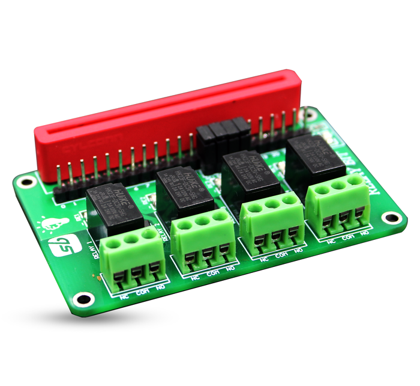
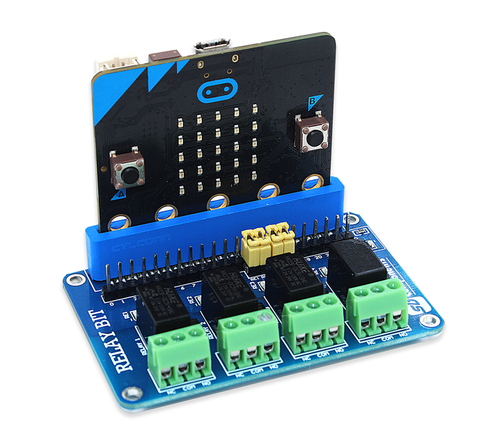

# RelayBit

 RelayBit is a micro:bit 4 Channel Relay HAT for various high current appliances and equipments.
 
   
 
### Specifications
 
 * Pin No. = P12 (Relay1), P13 (Relay 2), P14 (Relay 3), P15 (Relay 4)
 * Input Voltage = 3V
 * Channel - 4 CH
 * AC Control Voltage - 120V @ 2A
 * DC Control Voltage - 24V @ 2A

