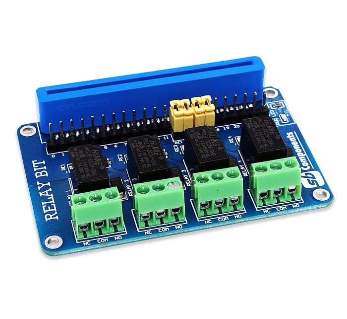

# RelayBit

 RelayBit is a micro:bit 4 Channel Relay HAT for various high current appliances and equipments.
 
   
 
### Specifications
 
 * Pin No. = 13, 14, 15, 16
 * Input Voltage = 3V
 * Channel - 4
 * AC Control Voltage - 120V @ 2A
 * DC Control Voltage - 24V @ 2A

